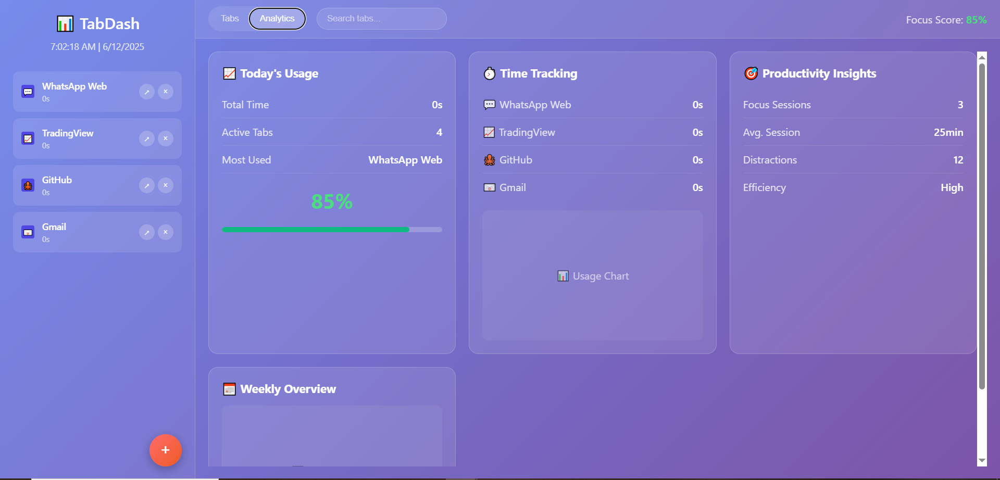

# 📊 TabDash - Productivity Dashboard for Your Daily Tabs

TabDash is a browser extension concept designed to simplify your tab chaos and centralize your productivity. It brings all your essential daily tabs (like WhatsApp Web, TradingView, GitHub, Gmail, etc.) into **one unified dashboard view**, allowing you to monitor and manage them from a single screen.

---

## ✨ Features

- 🧭 **Unified Dashboard**: View and control all your important tabs from one place.
- ➕ **Add New Tab**: Use the floating plus button to add your custom frequently-used tabs.
- 📊 **Analytics View**: 
  - Total Time Spent
  - Active Tab Tracking
  - Most Used Tab Stats
  - Productivity Score & Insights
  - Distraction Counter
  - Focus Sessions Analysis
- 📅 **Weekly Overview**: Visual breakdown of your productivity throughout the week.
- ⏱ **Time Tracking**: See exactly how much time you spend on each tab.
- 💹 **Usage Charts**: Data-driven insights to improve your digital efficiency.
- 🎯 **Efficiency Level**: Know how focused you’ve been based on your tab activity.

---

## 🚀 Purpose

TabDash is built to solve the **frustration of juggling multiple tabs daily**. Instead of bouncing between browser tabs and losing time and focus, TabDash gives you:

- A clean, centralized view
- Tab time management
- Custom tab shortcuts
- Behavioral insights

> Ideal for professionals, traders, developers, or anyone who lives in their browser.

---

## 💡 Future Ideas & Suggestions

- Dark Mode Toggle 🌙
- Focus Mode (block certain tabs temporarily) 🚫
- Pomodoro Timer Integration 🍅
- Cross-device tab sync ☁️
- Tab grouping by category 📁
- Real-time notification tracking 🔔

---

## 🛠 Tech Stack (Conceptual)

- Frontend: React, TailwindCSS
- Charts: Chart.js / Recharts
- State Management: Redux
- Extension API: Chrome Extensions APIs
- Storage: LocalStorage / IndexedDB

---

## 📂 Folder Structure

